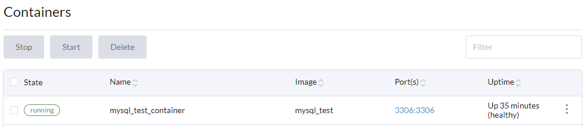

<!--    CTRL + SHIFT + P to export to PDf-->

# Docker / MySql

<br/><br/>
<br/><br/>
<br/><br/>
<br/><br/>

<!--
## For further reference, please consider the following sections:

* [https://www.baeldung.com/junit-before-beforeclass-beforeeach-beforeall](https://www.baeldung.com/junit-before-beforeclass-beforeeach-beforeall)
* [https://www.guru99.com/junit-assert.html](https://www.guru99.com/junit-assert.html)
* [https://www.baeldung.com/junit-5-test-order](https://www.baeldung.com/junit-5-test-order)
-->
<br/><br/>

<div style="page-break-after: always;"></div>

## Start a MySql container in one command

```
docker run -d -p 3306:3306 --name mysql-container -e MYSQL_ROOT_PASSWORD=root -e MYSQL_DATABASE=HARBOUR -e MYSQL_USER=djs -e MYSQL_PASSWORD=djs mysql:latest
```

## Doing the same with a Dockerfile and CLI

```
FROM mysql:latest

ENV MYSQL_ROOT_PASSWORD=root
ENV MYSQL_DATABASE=HARBOUR
ENV MYSQL_USER=djs
ENV MYSQL_PASSWORD=djs

EXPOSE 3306

# Copy sql files. They will be picked up and executed
ADD init.sql /docker-entrypoint-initdb.d
ADD measurements.sql /docker-entrypoint-initdb.d

# Backslash for splitting one line
HEALTHCHECK --start-period=5s --interval=30s --timeout=5s --retries=10 \
CMD mysqladmin ping -u root --password=$$MYSQL_ROOT_PASSWORD -h 127.0.0.1 || exit 1   
```

**_NOTE:_**  We need a healthcheck to test is MySql is ready. Running scripts may take a long time.<br>
$$ is correct. We can connect to the database if status is 'healthy'


[](## "Where did the image go..")

### Build image with name (tag) mysql-image

```
docker build -t mysql-image .
```
### start container with name mysql-container
```
docker run -d --name mysql-container -p 3306:3306 mysql-image
```

### Connect to database using MySql Workbench

Create queries to answer these questions:

* Number of wind speed measurements for location 'AAD' on 11-02-2020
* Maxium water height on 11-02-2020

<!--
Execute:
``` sql
SELECT MAX(M.MEASUREMENT_VALUE) FROM HARBOUR.MEASUREMENTS M, HARBOUR.SENSORS S
WHERE M.SENSOR_ID = S.ID AND S.MEASUREMENT_TYPE='WH'
AND DATE_FORMAT(STR_TO_DATE('11-02-2020', '%d-%m-%Y'), '%d-%m-%Y') = DATE_FORMAT(MEASUREMENT_DATE, '%d-%m-%Y');
```

Execute:

``` sql
SELECT COUNT(*) FROM HARBOUR.MEASUREMENTS M, HARBOUR.SENSORS S
WHERE M.SENSOR_ID = S.ID AND S.LOCATION_CODE = 'AAD' AND S.MEASUREMENT_TYPE='WS'
AND DATE_FORMAT(STR_TO_DATE('11-02-2020', '%d-%m-%Y'), '%d-%m-%Y') = DATE_FORMAT(MEASUREMENT_DATE, '%d-%m-%Y');
```
-->

